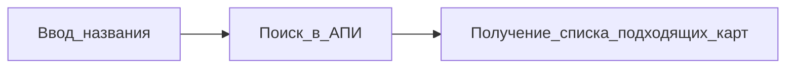
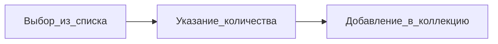
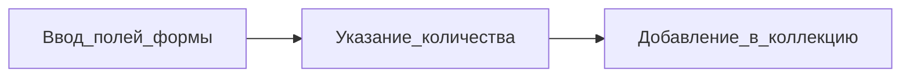

## Задача.
Хотелось бы создать небольшой сервис для отслеживания своей коллекции карт для MTG. Функционал подразумевает возможность добавления карт в коллекцию и создания колод. Такие сервисы уже существуют, но они либо платные с множеством лишних функций, либо нет множества карт (во всяком случае на русском), а добавить свою карту нельзя (или сложно). Есть идея не заниматься ручным добавлением карт в базу, а воспользоваться [АПИ Scryfall](https://scryfall.com/docs/api), судя по сайту, которым я успел попользоваться, база у них достаточная. Тем не менее, саму коллекцию, с основными параметрами карт (поля объекта карты в Scryfall избыточны) хочется хранить у себя в базе.

## Функционал.
### Поиск карты во внешнем сервисе. Добавление в коллекцию.

Поиск:

Добавление, если есть в списке:

Добавление, если нет ([[Проект сервиса карточно коллекции.#2.|скорее всего не удастся это реализовать]]):

### Менеджмент коллекции.
Возможность поиска по полям, сортировки, удаления, изменения количества экземпляров карт.

### Создание колоды.
Поиск карт в коллекции. Добавление в колоду с указанием количества. В будущем, можно добавить автоматический расчёт земель, статистику типов, mana-curve и прочие полезности.

## Сложности.
###### 1.
Основной вопрос для меня сейчас, как организовать модель карты. Какие поля карты делать внешними ключами, а какие нет. Насколько я слышал, избыточная нормализация БД - это плохо.
###### 2.
Самое сложное - проблема идентичности карты. Одинаковые карты могут быть изданы в разных сетах (одно название). Карты на разных языках, карты с разным "оформлением" и пр. Хотелось бы, чтобы это не влияло на поиск, при сохранении отслеживания уникальности карты. Скорее всего, проще отказаться от возможности добавить свою карту, так как в рамках АПИ Scryfall эта проблема решена.
###### 3.
Система учёта "нестандартных карт": двойные, двусторонние и пр. Благо в АПИ Scryfall есть указание как с ними работать. Так что хоть и муторно, но решаемо.

## Бэклог
##### Модели
Решил ориентироваться на АПИ как подсказку в основном: 
- Поля - просто поля, без внешних ключей (даже сет, который в АПИ отдельный объект).
- CardFace - поле для двойных карт (любых), отдельная сущность.
- ! Есть разногласие доки и реального результата запроса.

##### Работа с внешним АПИ
Попробую сделать как в домашке, с логгером и тп.

##### Работа своего АПИ
Вроде ничего необычного не предвидится.

##### Фронтенд(?)
Надо что-то быстренько накидать, наверное.